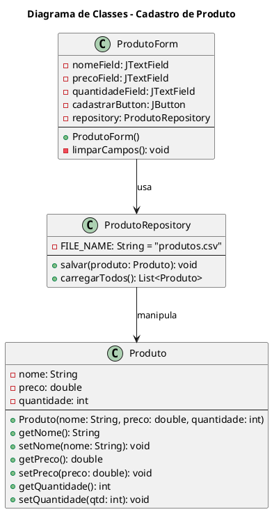
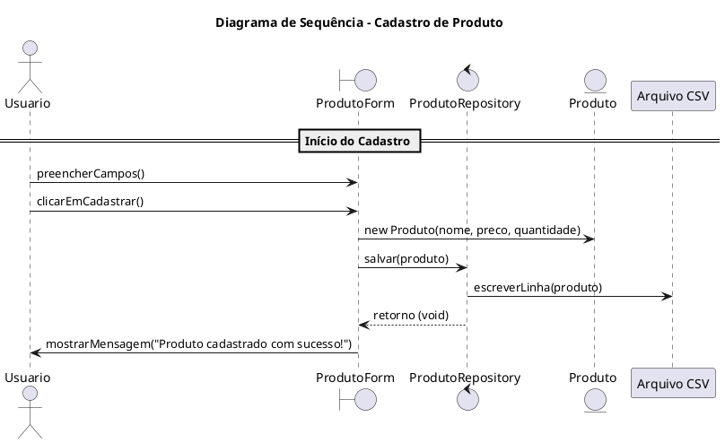

# Cadastro de Produto com Interface Gráfica (Java + CSV)

Este projeto é um exemplo didático utilizado na disciplina de **Projeto de Software**, com o objetivo de demonstrar a interação entre o **Diagrama de Classes** e o **Diagrama de Sequência**.

A funcionalidade implementada é o **Cadastro de Produtos**, onde os dados são inseridos por meio de uma **interface gráfica (Swing)** e armazenados em um arquivo **CSV**.

---

## ✨ Funcionalidade Principal

- Cadastro de produto com os campos:
  - Nome
  - Preço
  - Quantidade
- Armazenamento dos dados em arquivo CSV
- Interface simples com Java Swing

---

## 🧱 Estrutura do Projeto

- `Produto`: classe modelo que representa o produto
- `ProdutoRepository`: responsável por salvar e carregar os dados do arquivo CSV
- `ProdutoForm`: interface gráfica para entrada dos dados

> 💡 Opcionalmente, pode-se adicionar uma camada de serviço (`ProdutoService`) para centralizar regras de negócio.

---

## 📘 Diagrama de Classes

<!-- Substitua o link abaixo com a imagem do seu diagrama de classes -->
### Astah


---

### PlantUML


---

#### PlantUML – code



---

## 🔄 Diagrama de Sequência

<!-- Substitua o link abaixo com a imagem do seu diagrama de sequência -->
### Astah


---

### PlantUML


---

#### PlantUML – code



---

## ▶️ Como Executar

1. Clone este repositório:
   ```bash
   git clone https://github.com/seu-usuario/cadastro-produto-java.git
   ```
2. Compile os arquivos `.java`:
   ```bash
   javac *.java
   ```
3. Execute a interface gráfica:
   ```bash
   java ProdutoForm
   ```

---

## 🧠 Objetivos Didáticos

- Compreender o uso prático de diagramas UML (classes e sequência)
- Aplicar a arquitetura orientada a objetos
- Trabalhar com persistência de dados simples (CSV)
- Desenvolver interfaces gráficas com Swing

---

## 📂 Organização dos Arquivos

```
├── Produto.java
├── ProdutoRepository.java
├── ProdutoForm.java
├── produtos.csv
└── docs
    ├── diagrama-classes.png
    └── diagrama-sequencia.png
```

---

## 📄 Licença

Este projeto está licenciado sob os termos da licença MIT.  
Consulte o arquivo [LICENSE](LICENSE) para mais informações.

---

## 📸 Créditos

Professor Herysson – Projeto de Software  
Universidade Franciscana – Curso de Ciência da Computação

